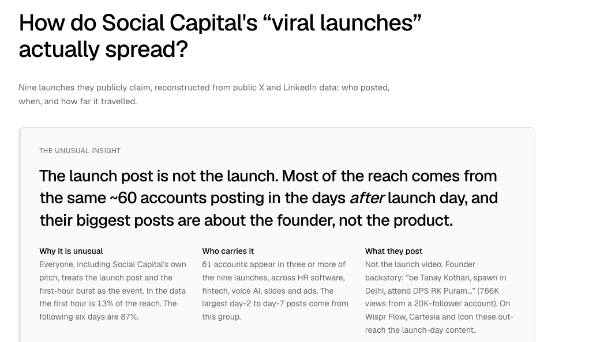
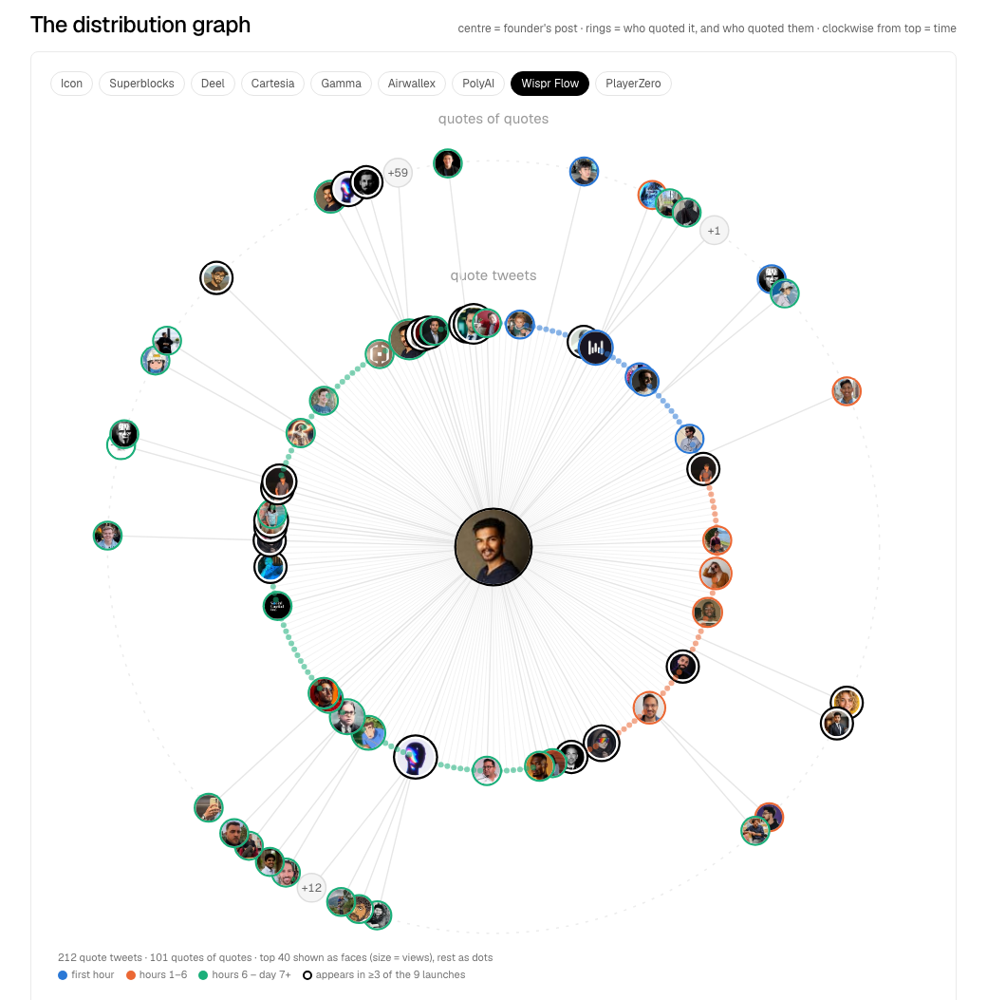
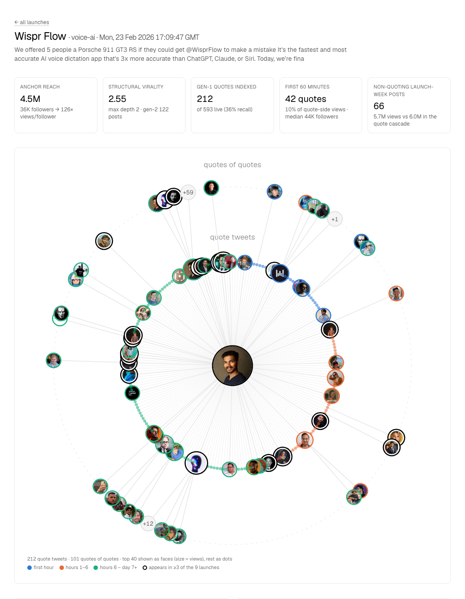
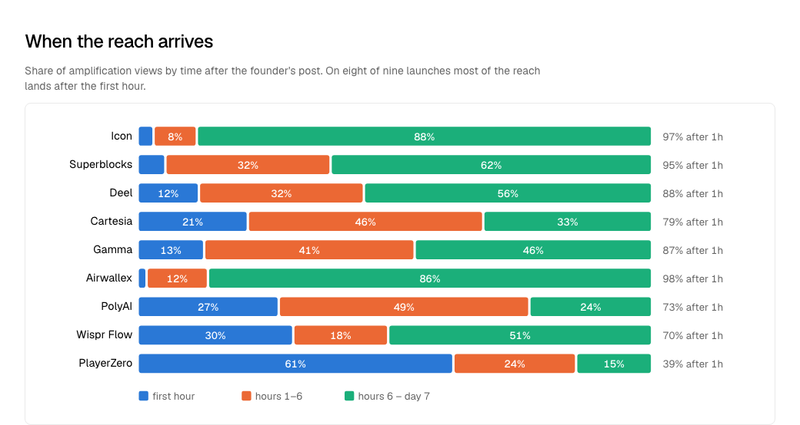
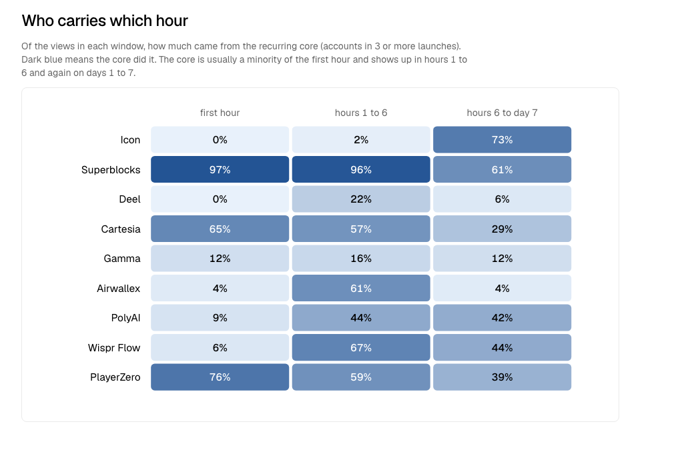
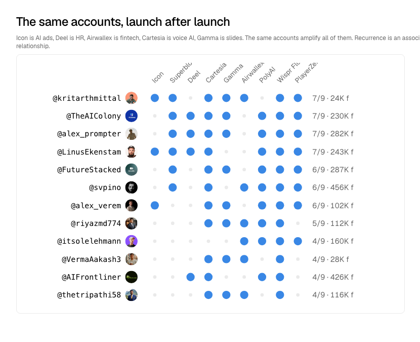
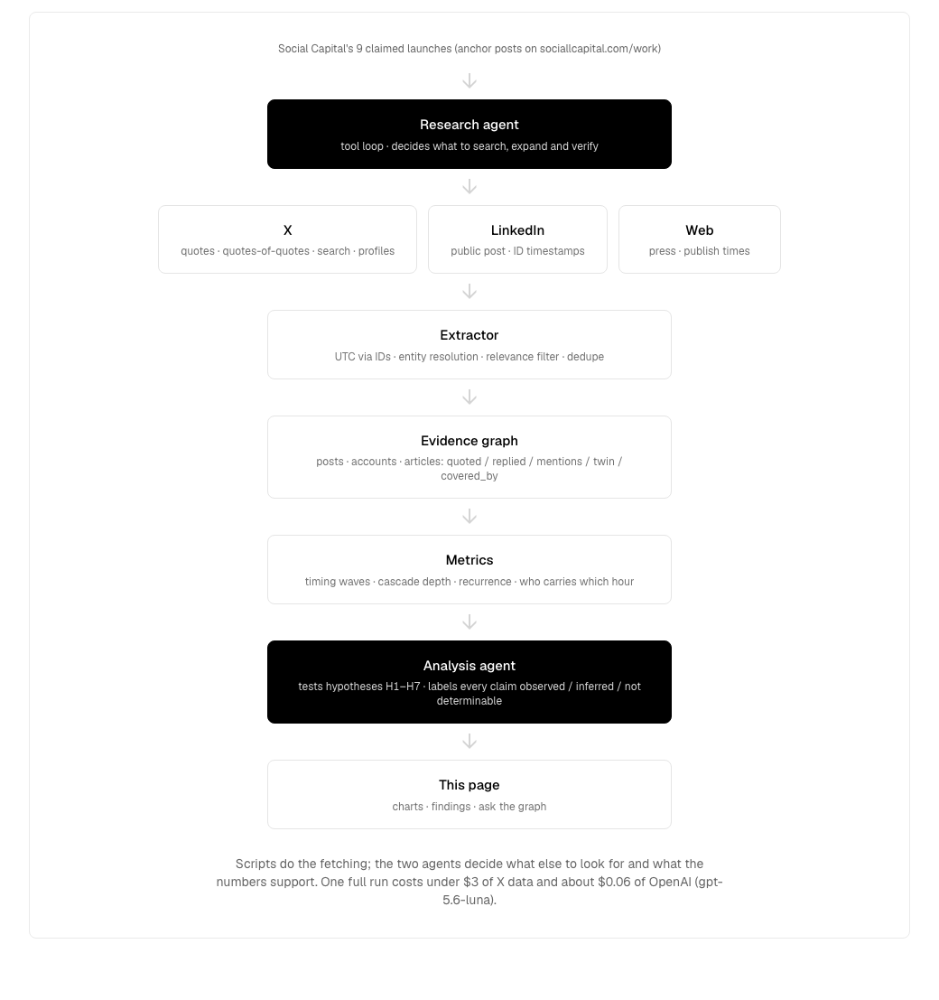

# Launch Distribution Graph

**How do Social Capital Inc.'s "guaranteed viral launches" actually spread?**
Nine launches they publicly claim, reconstructed from public X and LinkedIn data: who posted, when, and how far it travelled.

Built for the Social Capital Technical Generalist application challenge: *aggregate public information about one operational aspect of what Social Capital does and uncover one non-obvious insight about how they do things.* The aspect chosen is their creator distribution network, observed through the launches they list on [sociallcapital.com/work](https://www.sociallcapital.com/work).

---

## The unusual insight

> **The launch post is not the launch.** Across 9 launches, a median 87% of the reach comes after the first hour, with the same ~60 accounts showing up again and again.
>
> And the weird part is what they talk about. Their biggest posts are often about the founder, not the product. For Wispr Flow, Cartesia and Icon, founder stories from these recurring accounts pulled more attention than the actual launch content.
>
> **The product gets launched. The founder becomes the story.**



Three facts, measured across all nine launches:

| | Number | What it means |
|---|---|---|
| Reach after the first hour | **87%** (median) | Everyone, including Social Capital's own pitch, treats the launch post and the first-hour burst as the event. In the data the first hour is 13% of the reach; the following six days are 87%. |
| Recurring core | **61 accounts** in 3 or more of the 9 launches | The same amplifiers show up whether the product is HR software (Deel), fintech (Airwallex), voice AI (Cartesia, Wispr Flow, PolyAI), slides (Gamma) or ads (Icon). Social Capital's own co-founder is among the first quoters on four launches. |
| Cascade depth | **2 hops** on every launch, structural virality 2.0 to 2.55 | Nothing spreads on its own. By the Goel, Anderson, Hofman and Watts (2016) measure, 2.0 is a pure broadcast. The reach is manufactured, not contagious, which is precisely what makes it repeatable. |

What the late posts look like: not the launch video that took two weeks to make, but founder backstory from mid-sized accounts. "be Tanay Kothari, spawn in Delhi, attend DPS RK Puram..." got 766K views from a 20K-follower account 12 hours after the Wispr Flow anchor. On Wispr Flow, Cartesia and Icon, these day-2 to day-7 posts out-reach the launch-day content, and they come from the recurring core.

What this does **not** say: that anyone was paid or briefed (only recurrence and timing are observable), or that any post caused another (timing shows sequence, never cause).

---

## The distribution graph

Centre is the founder's anchor post. Ring 1 is every quote tweet, clockwise from 12 o'clock in time order. Ring 2 is quotes of quotes. The top 40 amplifiers are drawn with their X profile pictures, sized by views; the long tail is drawn as dots so the shape stays honest. Colour is the phase after the anchor (blue first hour, orange hours 1 to 6, green hours 6 to day 7). A black ring marks an account that appears in three or more of the nine launches.



Nothing spreads past the second ring, on any launch. The large fan at 11 o'clock is the founder's own follow-up post four days later, which collected 94 quotes of its own.

Each launch has its own page with the same tree, a timing histogram, the cross-platform timeline (X anchor, LinkedIn twin, press, follow-ups) and the accounts that carried each phase:



---

## Supporting evidence

### When the reach arrives

Share of amplification views (quotes, quotes of quotes, launch-week posts) by time after the anchor post. On eight of nine launches most of the reach lands after the first hour.



### Who carries which hour

Of the views in each window, how much came from the recurring core. There is no single timing playbook: the core is a minority of the first hour on six of nine launches and dominates hours 1 to 6 (Wispr Flow, Airwallex, Cartesia, Superblocks) or days 1 to 7 (Icon, PolyAI). Two launches (Superblocks, PlayerZero) are front-loaded instead.



### The same accounts, launch after launch



---

## How it was built



```
harness/
  config.ts                  the 9 launches: anchor IDs, LinkedIn URLs, search queries, relevance terms
  sources/x.ts               twitterapi.io (quotes, search, replies, profiles) + fxtwitter live counters
  sources/linkedin.ts        logged-out public post; timestamps decoded from activity IDs (ms precision)
  sources/web.ts             press pages: title, publish time, embedded X handles
  collect.ts                 deterministic collection plan  ->  data/launches/<slug>.json
  agents/research-agent.ts   tool-loop agent: alternative searches, account roles, narratives
  extract.ts                 evidence graph  ->  data/graph/<slug>.json
  metrics.ts                 waves, structural virality, recurrence, phases  ->  data/metrics.json
  agents/analysis-agent.ts   tests hypotheses H1 to H7, classifies content, labels findings  ->  data/findings.json
  lib/llm.ts                 model, prompt caching, context compaction, usage reporting
  run.ts                     pipeline: collect -> research -> extract -> metrics -> analyse
app/                         Next.js 16 site (static) + /api/ask (streams answers from the graph)
components/                  cascade tree, charts, system diagram, ask box
data/                        launches, graphs, metrics, findings (committed); raw HTTP cache (ignored)
```

**Why a harness and not a script.** Fetching quotes is a script. Deciding which of 200 quotes deserve a second-generation expansion, which alternative phrasings will find the standalone posts a product-name query misses, who the earliest quoters are, and whether a hypothesis survives the numbers is not. The Research Agent does the first three with tools; the Analysis Agent does the last, and every claim it writes is labelled **observed / inferred / not determinable** and has to cite numbers.

**Evidence graph.** Nodes are posts, accounts and articles. Edges are only relationships that are directly observable in public data: `quoted`, `replied_to`, `mentions`, `cross_platform_twin`, `covered_by`. "After" is derived from timestamps at analysis time. No edge ever means "caused".

**Timestamps.** X post IDs encode creation time (snowflake). LinkedIn activity IDs encode a millisecond timestamp too (`id >> 22`), verified against the X anchors: LinkedIn twins go live between 9 minutes before and 7 minutes after the X post.

**Cost.** One full run is under $3 of X data (twitterapi.io, $0.15 per 1,000 tweets) and about $0.06 of OpenAI. The agents run on `gpt-5.6-luna` with prompt caching, low reasoning effort and context compaction (`prepareStep` + `pruneMessages`), which took a first estimate of $13 to $18 down two orders of magnitude. Every outbound request is cached under `data/raw/`, so reruns are free.

---

## Run it

```bash
pnpm install
cp .env.example .env.local      # TWITTER_API_KEY required; OPENAI_API_KEY optional
pnpm harness                     # collect -> [research agent] -> extract -> metrics -> [analysis agent]
pnpm dev                         # http://localhost:3000
```

Without `OPENAI_API_KEY` the deterministic layers run end to end; the two agents and the ask box are skipped and the site says so. Individual stages: `pnpm harness:collect`, `harness:research`, `harness:extract`, `harness:metrics`, `harness:analyze`.

The site is static (both the overview and the nine launch pages are prerendered from `data/`), so visitors trigger no API calls. Only `/api/ask` is live: it answers questions from the evidence graph through query tools and streams the reply.

---

## Limits, stated plainly

- **Quote recall is 17 to 61% per launch.** X's search index drops deleted, suspended and low-quality quotes. The count is printed on every page. Missing quotes are overwhelmingly low-view, so view-weighted coverage is much higher than the count suggests, but it is still a sample.
- **Retweets cannot be time-placed** (retweeter lists carry no timestamps) and are excluded from the wave charts. Wispr Flow had 2,875 retweets against 593 quotes, so retweets carry volume the cascade tree does not show.
- **LinkedIn** gives reactions and comments logged-out, not views or reposts.
- **Payment and briefing are not observable.** Recurrence across unrelated product categories is the strongest public signal of a managed network. It is still an association.
- **Causation is not observable.** A post at +11 minutes followed the anchor. Nothing shows it was caused by it.
- **Lovable** is claimed by Social Capital in talks but has no published anchor, so it is excluded rather than guessed.

## Sources

Social Capital's site, work pages and careers material; the nine anchor posts and their LinkedIn twins; twitterapi.io and fxtwitter for X data; press coverage (TechCrunch, PiunikaWeb, AI Voice Newsletter); Goel, Anderson, Hofman and Watts, *The Structural Virality of Online Diffusion*, Management Science 2016. The full research reports that preceded the build are in `docs/`.
